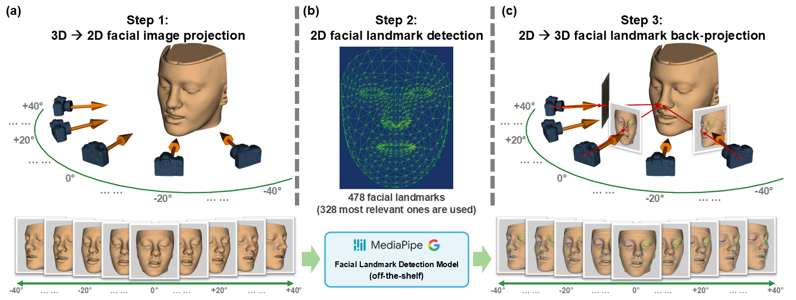
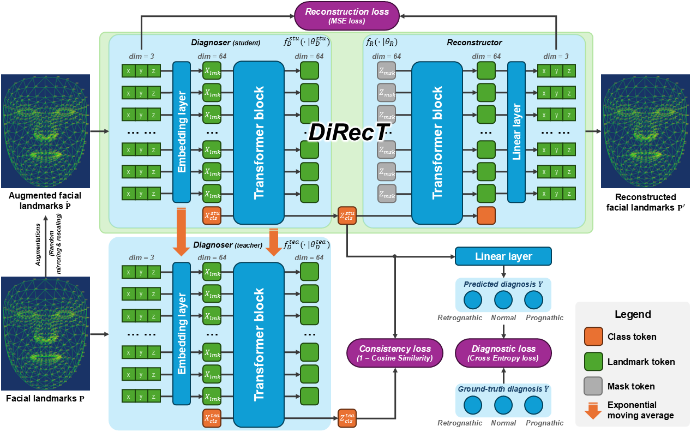

# DiRecT
MICCAI'24 - DiRecT: Diagnosis and Reconstruction Transformer for Mandibular Deformity Assessment

[[Paper PDF](https://papers.miccai.org/miccai-2024/paper/1074_paper.pdf)] [[Open review](https://papers.miccai.org/miccai-2024/232-Paper1074.html)]

## Update
  - **Oct 8, 2024**: Source code released.
  - **Oct 5, 2024**: We appologize for the delay in releasing our source code due to an unexpected crash-down of our data server. We will resolve the issue and release the code by the week of MICCAI 2024.

## Citation
  *X. Xu, J. Lee, N. Lampen, D. Kim, T. Kuang, H. H. Deng, M. A. K. Liebschner, J. Gateno, and P. Yan, "DiRecT: Diagnosis and Reconstruction Transformer for Mandibular Deformity Assessment," in 27th International Conference on Medical Image Computing and Computer Assisted Intervention (MICCAI 2024). Marrakesh, Morocco, Oct. 6-10, 2024.*

    @inproceedings{Xu2024DiRecT, 
      title={DiRecT: Diagnosis and Reconstruction Transformer for Mandibular Deformity Assessment},
      author={Xuanang Xu and Jungwook Lee and Nathan Lampen and Daeseung Kim and Tianshu Kuang and Hannah H. Deng and Michael A. K. Liebschner and Jaime Gateno and Pingkun Yan},
      booktitle={Medical Image Computing and Computer Assisted Intervention -- MICCAI 2024},
      year={2024},
    }

## Abstract
In the realm of orthognathic surgical planning, the precision of mandibular deformity diagnosis is paramount to ensure favorable treatment outcomes. Traditional methods, reliant on the meticulous identification of bony landmarks via radiographic imaging techniques such as cone beam computed tomography (CBCT), are both resource-intensive and costly. In this paper, we present a novel way to diagnose mandibular deformities in which we harness facial landmarks detectable by off-the-shelf generic models, thus eliminating the necessity for bony landmark identification. We propose the Diagnosis-Reconstruction Transformer (DiRecT), an advanced network that exploits the automatically detected 3D facial landmarks to assess mandibular deformities. DiRecT's training is augmented with an auxiliary task of landmark reconstruction and is further enhanced by a teacher-student semi-supervised learning framework, enabling effective utilization of both labeled and unlabeled data to learn discriminative representations. Our study encompassed a comprehensive set of experiments utilizing an in-house clinical dataset of 101 subjects, alongside a public non-medical dataset of 1,519 subjects. The experimental results illustrate that our method markedly streamlines the mandibular deformity diagnostic workflow and exhibits promising diagnostic performance when compared with the baseline methods, which demonstrates DiRecT's potential as an alternative to conventional diagnostic protocols in the field of orthognathic surgery. Source code is publicly available at [https://github.com/RPIDIAL/DiRecT](https://github.com/RPIDIAL/DiRecT).

## Method
### 3D facial landmark extraction using the MediaPipe framework
The Google MidiaPipe model is originally trained to extract 2D facial landmarks from face photos. We designed the following pipeline to adapt it for 3D facial landmark extraction.

### Scheme of our DiRecT network

## Contact
You are welcome to contact us:  
  - [xux12@rpi.edu](mailto:xux12@rpi.edu)(Dr. Xuanang Xu)